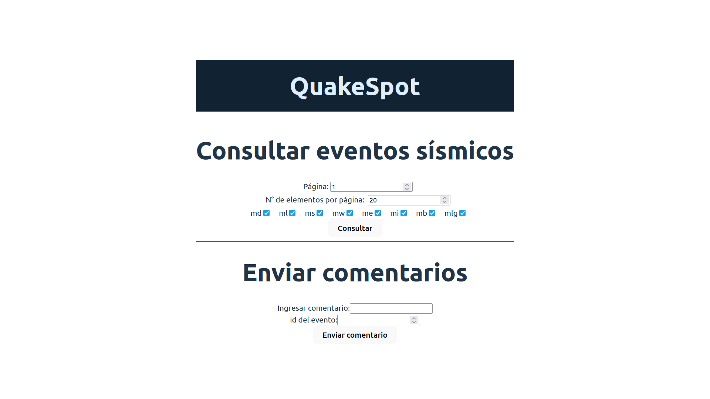
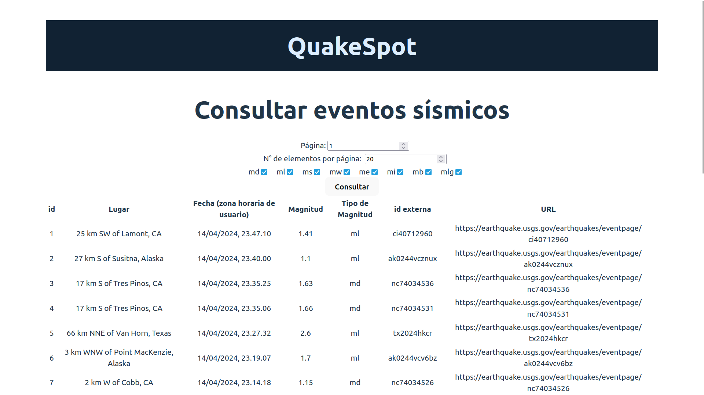

# Quakespot

API y página web para ver datos de sismos y realizar comentarios. Postulación a Frogmi.

## Instrucciones:

`git clone https://github.com/sandov/quakespot`

`cd quakespot`

`bin/rails db:migrate`

Obtenemos datos desde USGS y persistimos en la db. Esto puede tomar más de 10 segundos:

`bin/rake fetch_seismic_data`

Iniciamos el servidor que va a servir nuestra API:

`bin/rails s`

En otra terminal, ingresamos al directorio de nuestro frontend:

`cd quakespot-client`

Instalamos dependencias del frontend:

`npm install`

Ejecutamos el servidor del frontend:

`npm run dev`

Ahora, visitamos `http://localhost:5173/` en nuestro navegador, y deberíamos ver la interfaz de QuakeSpot:

Si realizamos una consulta:

