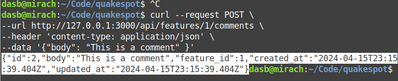

# Quakespot

API y página web para ver datos de sismos y realizar comentarios. Postulación a Frogmi.

## Levantar API:

`git clone https://github.com/sandov/quakespot`

`cd quakespot`

`bin/rails db:migrate`

Obtenemos datos desde USGS y persistimos en la db. Esto puede tomar más de 10 segundos:

`bin/rake fetch_seismic_data`

Iniciamos el servidor que va a servir nuestra API:

`bin/rails s`

Así, la API queda disponible en `localhost:3000/`.

Por ejemplo, para acceder a la lista de features:

`http://127.0.0.1:3000/api/features`

Esto devuelve una página con 10 features, sin filtrar según tipo.

Si queremos obtener página con 1000 features:

`http://127.0.0.1:3000/api/features?per_page=1000`

La segunda página, manteniendo el número de features por página, será:

`http://127.0.0.1:3000/api/features?page=2&per_page=1000`

Si queremos mostrar solo features con mag_type md o ml:

`http://127.0.0.1:3000/api/features?mag_type=md,ml`

Combinar filtro mag_type con paginación de 1000 features, página 2:

`http://127.0.0.1:3000/api/features?page=2&per_page=1000?mag_type=md,ml`

### Comentarios

Se puede enviar comentarios a `http://127.0.0.1:3000/api/features/1/comments`, cambiar el `1` por el id de la feature sobre la que se quiera comentar.

`curl --request POST \
--url http://127.0.0.1:3000/api/features/1/comments \
--header 'content-type: application/json' \
--data '{"body": "This is a comment" }`

## Levantar Frontend:

En otra terminal, ingresamos al directorio de nuestro frontend:

`cd quakespot-client`

Instalamos dependencias del frontend:

`npm install`

Ejecutamos el servidor del frontend:

`npm run dev`

Ahora, visitamos `http://localhost:5173/` en nuestro navegador, y deberíamos ver la interfaz de QuakeSpot:

Si realizamos una consulta:

